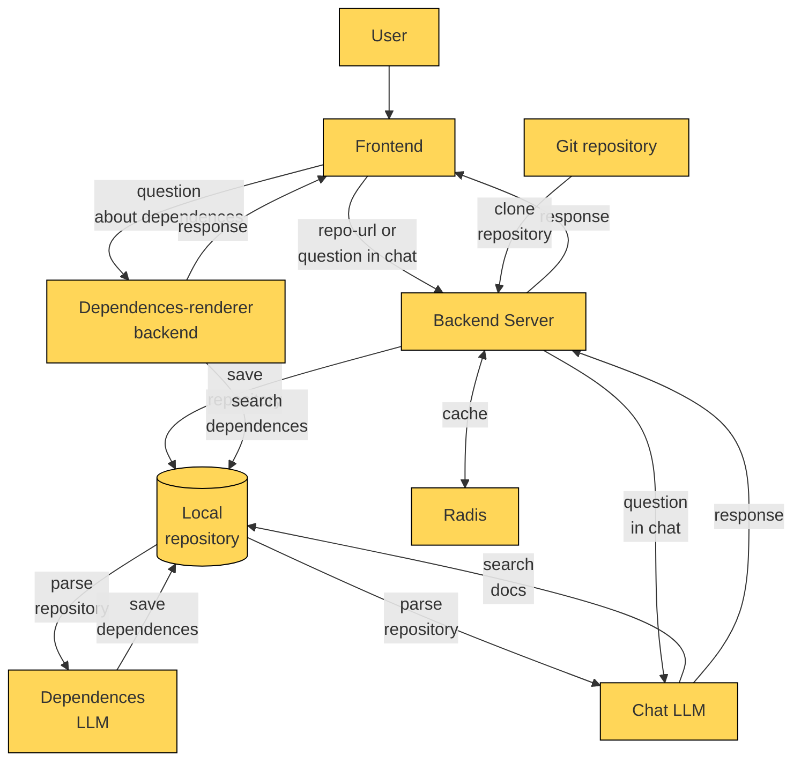

# Research doc

## Оглавление

1. [Обзор](#обзор)
2. [Начало работы](#начало-работы)
3. [Вопрос - ответ](#faq)
4. [Архитектура](#архитектура)
5. [Установка и запуск](#установка-и-запуск)
6. [API Endpoints](#api-endpoints)
7. [Фронтенд](#фронтенд)
8. [Обработка кода](#обработка-кода)
9. [Чат и диаграммы зависимостей](#чат-и-диаграммы-зависимостей)
10. [Развертывание](#развертывание)
11. [Тестирование](#тестирование)
12. [Масштабирование](#масштабирование)
13. [Выводы](#итог)

## Обзор
Нашь проект - это веб-приложение, которое анализирует код GitHub репозиториев, генерирует комплексную документацию и предоставляет интерактивный интерфейс для вопросов и визуализации зависимостей в проекте, написанном на python или java (моноязычность обеспечена по условию задания).

Основные функции:

- Анализ кода через AST деревья
- Генерация документации с помощью LLM (ChatGPT 4o mini)
- Интерактивный чат для вопросов по проекту
- Визуализация зависимостей между компонентами
- RAG (Retrieval-Augmented Generation) для точных ответов

## Начало работы

Для начала работы вам нужно загрузить ссылку на гит.

После этого мы проанализируем ваш проект, это может занять некоторое время. В результате вы получите обобщенное описание вашего проекта и архитектуру в нотации С4 PlantUML.

---------------------

## FAQ

После получения общей информации о проекте, вы сможете задавать конкретные вопросы в чате, например:

- Что делает функция `func | class | elem`
- Что изменится в пректе при изменении `func | class | elem`

## Архитектура

Диаграмма в mermaid:



### Компоненты системы

1. **Frontend**: React-приложение
2. **Backend API**: Python (FastAPI)
   - Основной сервер для обработки запросов
   - Сервис генерации документации
3. **Dependency Visualizer**: Отдельный сервис для визуализации зависимостей
4. **LLM Services**: Интеграция с ChatGPT 4o mini
5. **Storage**: Хранение обработанных данных и документации

### Схема взаимодействия

```text
Пользователь → Frontend (React) → Backend API (FastAPI)
                                → Dependency Visualizer
                                → LLM Services
```

## Установка и запуск

### Требования

- Python 3.9+
- React 16+
- Docker
- API ключ OpenAI

### Backend

1. Установите зависимости:
```bash
cd backend
pip install -r requirements.txt
```

2. Настройте переменные окружения (создайте `.env` файл):
```
OPENAI_API_KEY=your_api_key
GITHUB_TOKEN=your_github_token
DATABASE_URL=sqlite:///./code_doc.db
```

3. Запустите сервер:
```bash
uvicorn main:app --reload
```

### Frontend
1. Установите зависимости:
```bash
cd frontend
npm install
```

2. Запустите приложение:
```bash
npm start
```

### Dependency Visualizer

```bash
cd dependency_visualizer
pip install -r requirements.txt
python server.py
```

## API Endpoints

### Основной сервер

- `POST /api/repository` - Отправить ссылку на GitHub репозиторий
- `GET /api/documentation/{repo_id}` - Получить сгенерированную документацию
- `POST /api/chat/{repo_id}` - Отправить вопрос по проекту

### Сервис визуализации

- `GET /api/dependencies/{repo_id}` - Получить полный граф зависимостей
- `POST /api/dependencies/filter` - Получить отфильтрованные зависимости

## Фронтенд

### Структура компонентов
- `RepositoryInput` - Форма ввода GitHub ссылки
- `DocumentationView` - Отображение сгенерированной документации
- `ChatInterface` - Интерфейс чата с историей сообщений
- `DependencyGraph` - Визуализация графа зависимостей (использует D3.js)

### Основные маршруты
- `/` - Ввод репозитория
- `/docs/{repoId}` - Просмотр документации
- `/chat/{repoId}` - Чат с документацией
- `/dependencies/{repoId}` - Граф зависимостей

## Обработка кода

### Процесс анализа
1. Клонирование репозитория
2. Обход файловой структуры
3. Построение AST для каждого файла
4. Анализ зависимостей между файлами/классами/функциями
5. Генерация метаданных о проекте

```python
# Пример обработки AST
import ast

class CodeAnalyzer(ast.NodeVisitor):
    def visit_FunctionDef(self, node):
        # Анализ функций
        pass
        
    def visit_ClassDef(self, node):
        # Анализ классов
        pass
```

### Генерация документации
1. Сбор метаданных из AST анализа
2. Формирование контекста для LLM
3. Генерация разделов документации:
   - Общее описание проекта
   - Модули и их назначение
   - Основные классы и функции
   - Примеры использования

## Чат и диаграммы зависимостей

### Чат с документацией
1. Пользователь задает вопрос
2. Система ищет релевантные фрагменты документации
3. LLM формирует ответ на основе контекста
4. Ответ отображается пользователю

### Визуализация зависимостей
1. Пользователь запрашивает зависимости
2. Фронтенд получает mermaid, отображающий зависимости
3. Отрисовка графа с возможностью:
   - Увеличения/уменьшения
   - Просмотра деталей при нажатии

```javascript
// Пример отрисовки графа
function renderGraph(data) {
  const simulation = d3.forceSimulation(data.nodes)
    .force("link", d3.forceLink(data.links).id(d => d.id))
    .force("charge", d3.forceManyBody())
    .force("center", d3.forceCenter(width / 2, height / 2));
}
```

## Развертывание

### Docker
```dockerfile
# Backend
FROM python:3.9
COPY ./backend /app
WORKDIR /app
RUN pip install -r requirements.txt
CMD ["uvicorn", "main:app", "--host", "0.0.0.0", "--port", "8000"]

# Frontend
FROM node:16
COPY ./frontend /app
WORKDIR /app
RUN npm install
RUN npm run build
CMD ["npm", "start"]
```

### Kubernetes (опционально)
```yaml
apiVersion: apps/v1
kind: Deployment
metadata:
  name: codedoc-backend
spec:
  replicas: 3
  template:
    spec:
      containers:
      - name: backend
        image: codedoc-backend:latest
        ports:
        - containerPort: 8000
```

## **Тестирование**  

### **1. Интеграционное тестирование обработки GitHub-репозитория**  
**Цель:** Проверить полный цикл обработки репозитория — от отправки ссылки до генерации документации.  

**Сценарий:**  
1. **Отправка валидной GitHub-ссылки** → ожидаем успешный ответ с `repo_id`.  
2. **Проверка статуса обработки** (если реализовано) → ожидаем переход из `processing` в `completed`.  
3. **Запрос сгенерированной документации** → проверяем структуру (наличие разделов: Overview, Modules, Classes).  
4. **Попытка запроса несуществующего репозитория** → ожидаем `404 Not Found`.  

**Возможные ошибки:**  
- Таймаут при клонировании большого репозитория.  
- Некорректный парсинг репозиториев с нестандартной структурой.  

---  

### **2. Тестирование RAG-чата**  
**Цель:** Убедиться, что система корректно отвечает на вопросы, используя контекст из документации.  

**Сценарии:**  
- **Общий вопрос** («Как работает модуль X?») → ответ должен содержать информацию из соответствующего раздела документации.  
- **Вопрос о зависимостях** («Какие модули используют класс Y?») → ответ должен включать связи из графа зависимостей.  
- **Вопрос без контекста** («Что такое ООП?») → система должна либо ответить в общих чертах, либо сообщить, что вопрос не относится к проекту.  

**Проверяемые аспекты:**  
- Точность извлечения контекста (не должно быть «галлюцинаций»).  
- Скорость ответа (задержка не должна превышать 3-5 секунд).  

---  

### **3. Тестирование визуализации зависимостей**  
**Цель:** Проверить корректность отображения графа зависимостей и работу фильтров.  

**Сценарии:**  
- **Загрузка графа для большого проекта** → проверка производительности (не должно быть «подвисаний»).  
- **Фильтрация по типу связи** (импорты, наследование) → убедиться, что отображаются только нужные ребра.  
- **Клики на узлы** → проверка всплывающих подсказок с деталями о модуле/классе.  

**Особые случаи:**  
- Репозиторий без явных зависимостей (например, скрипт из одного файла) → система должна показать информативное сообщение.  
- Циклические зависимости → граф должен отображаться без ошибок.  

---  

### **4. Нагрузочное тестирование**  
**Цель:** Оценить стабильность системы при одновременной обработке нескольких репозиториев.  

**Метрики:**  
- Время обработки репозитория (должно расти линейно, а не экспоненциально).  
- Потребление памяти сервисом анализа кода.  
- Количество одновременных запросов, при которых сервер начинает возвращать `503 Service Unavailable`.  

**Инструменты:**  
- Locust (для эмуляции множества пользователей).  
- Мониторинг через Prometheus + Grafana.  

---  

### **5. Юзабилити-тестирование фронтенда**  
**Цель:** Выявить проблемы в интерфейсе, которые мешают пользователям.  

**Проверяемые сценарии:**  
- **Ввод GitHub-ссылки:**  
  - Поддержка разных форматов (`https://github.com/user/repo`, `git@github.com:user/repo.git`).  
  - Валидация ошибочных URL (вывод понятного сообщения).  
- **Работа с документацией:**  
  - Навигация по разделам (оглавление, поиск по тексту).  
  - Копирование кода из примеров.  
- **Чат:**  
  - История сообщений при перезагрузке страницы (если не реализовано сохранение — явное предупреждение).  

---  

### **6. Тестирование безопасности**  
**Цель:** Исключить уязвимости.  

**Проверки:**  
- **GitHub-ссылки:** Защита от SSRF (например, попытка отправить `http://internal-server/`).  
- **Чат:** Санитизация ввода (XSS-атаки через вопросы).  
- **API:** Авторизация для защищенных эндпоинтов (если есть).  

---  

### **7. Тестирование ошибок и edge-cases**  
**Сценарии:**  
- **Пустой репозиторий** → система должна корректно обработать, а не упасть.  
- **Бинарные файлы в репозитории** (например, `.jpg`, `.pdf`) → должны игнорироваться при анализе.  
- **Очень длинные имена классов/функций** → проверка на переполнение UI.  

---  

### **Итог по тестированию**  
Комплексное тестирование должно включать:  
1. **Модульные тесты** — для отдельных функций (анализа кода, запросов к LLM).  
2. **Интеграционные тесты** — проверка взаимодействия компонентов.  
3. **E2E-тесты** — симуляция действий пользователя.  
4. **Нагрузочные тесты** — оценка стабильности.  
5. **Ручное тестирование edge-cases** — обработка нестандартных ситуаций.  

Для CI/CD можно использовать комбинацию `pytest` (бекенд), `Jest` + `React Testing Library` (фронтенд) и `Locust` (нагрузка).

## Масштабирование

- Добавить больше языков
- Проработать систему безопасности
  - OAuth2/OpenID Connect для единого входа (SSO) в корпоративной сети
  - Механизм rate‑limiting и детекция аномалий запросов для предотвращения атак.
- Интерактивная обратная связь
  - Когдаё пользователь наводит на участки кода, которые ему непонятны, мы собираем это и в конце выводим по ним сводку

## Итог

Наше приложение обеспечивает:

- Снижение времени на анализ кода за счёт автоматической генерации диаграмм и докстрингов.
- Уменьшение числа ошибок при рефакторинге благодаря наглядным графам зависимостей.
- Ускорение онбординга новых участников: в режиме вопрос-ответ ассистент пояснит структуру проекта без ручного чтения всех файлов.
- Повышение качества документации: единообразные docstring’и, встроенные в код.

